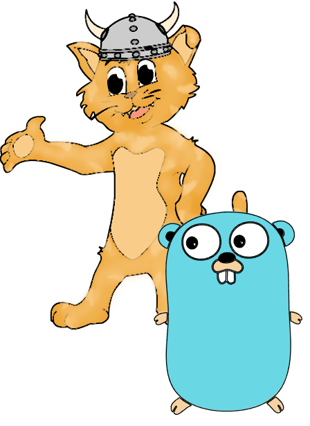

===

**Tabby** (not to be confused with my [other project](https://github.com/Anima-OS/Tabby) of the same name) is a simple, modern (toy) programming
language that seeks to offer a syntax fans of the Go programming language
will feel accustomed to, while also providing additional safety assurances
and manual memory management.

It is based on the venerable [go-compiler project](https://github.com/Lebonesco/go-compiler) by _Lebonesco_, which I consider an excellent starting point.

While **Tabby** is still an immature toy language, it is inspired by the valiant efforts of far more mature but no less revolutionary
products such as [V](https://vlang.io/), [Odin](https://odin-lang.org/) and Jonathan Blow's [Jai](https://github.com/BSVino/JaiPrimer). 
The latter of which is what first got me interested in language design.

 ## Note: The logo/mascot is, by no means, final. It merely presents a "quick & dirty" solution, re-using my old OS effort's mascot and pairing him with Go's gopher as a means to represent the language's heritage.
